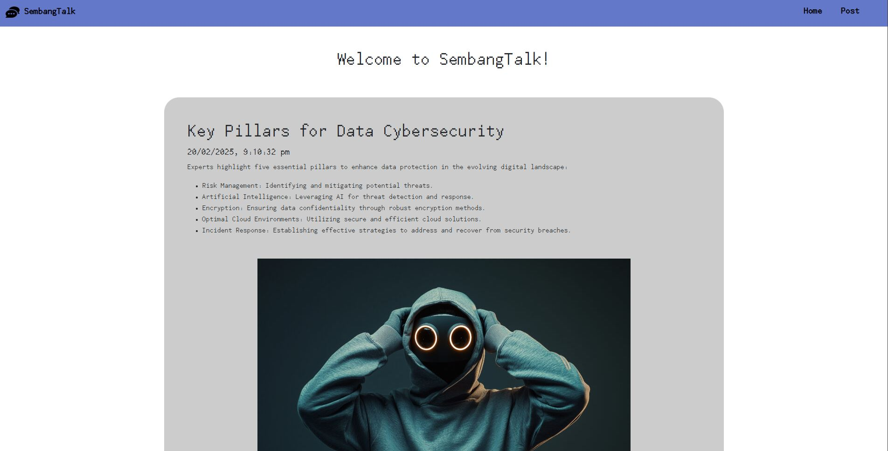
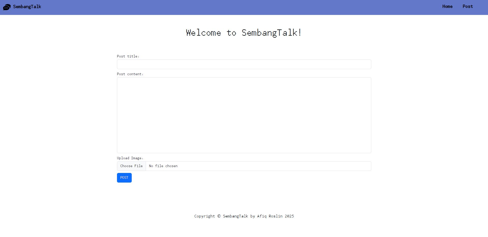
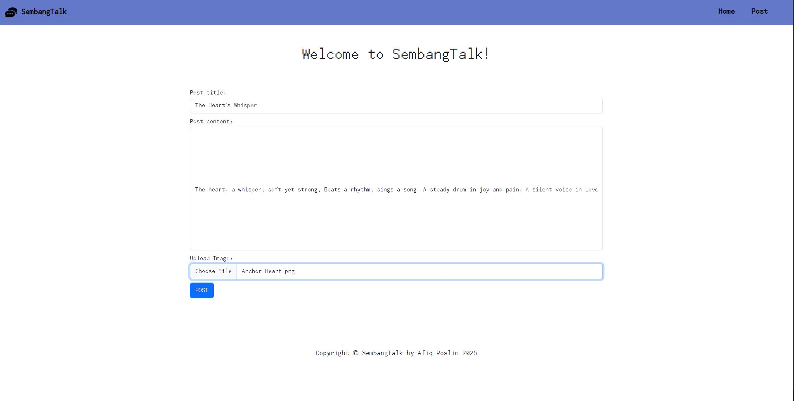
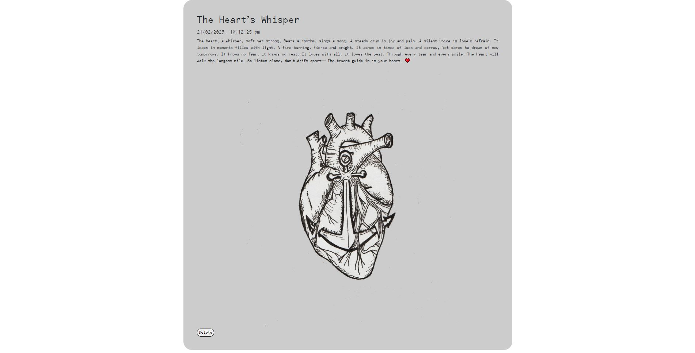

# Blog Web Application
Simple blog web application built with Node.js, Express.js, EJS, and Bootstrap.

## Visit
https://sembangtalk.onrender.com/

## How to Use

Clone and install the project:

```bash
  git clone https://github.com/afiqroslin/Blog-web-app.git
  cd {file path}
  npm install
  node index.js
```


Open browser and surf http://localhost:3000.












